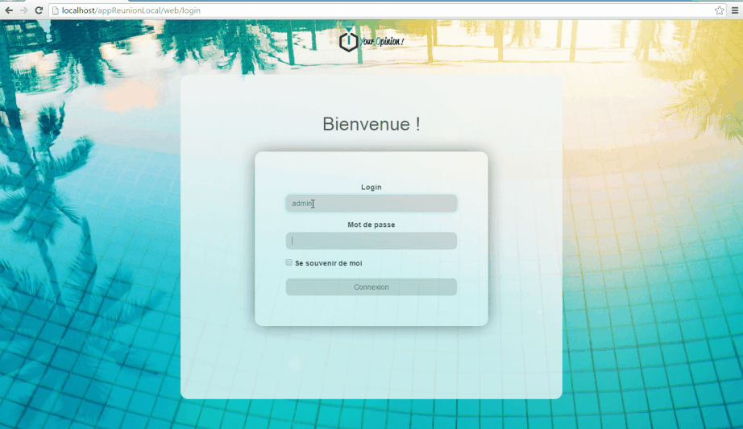
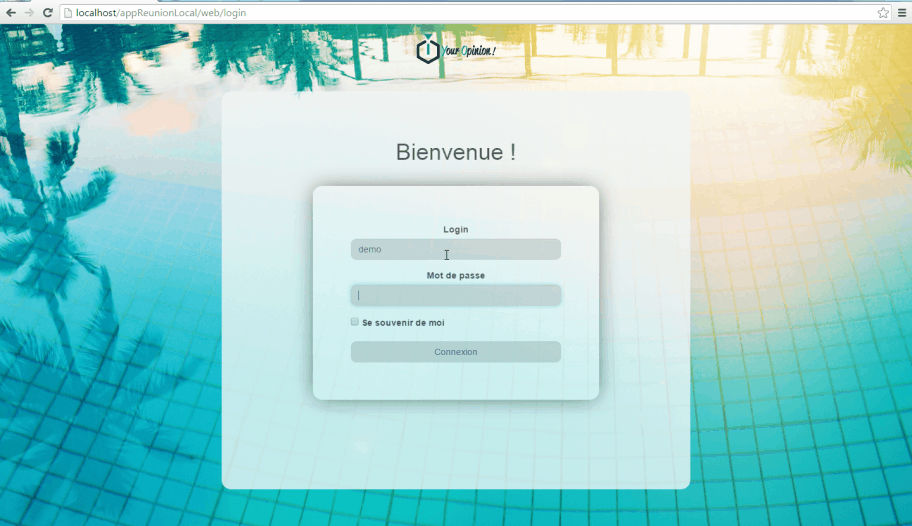

#Your opinion !

##Description du projet :

Your Opinion ! est une application web responsive qui fonctionne en temps réel pour différentes manifestations / évènements / séminaires, colloques, discours, conférences, etc.
L’objectif de cette application est de permettre aux utilisateurs, en se connectant à tel ou tel évènement, de poser leurs questions  et de "liké" ou "disliké" les autres questions. 
Ensuite l’administrateur (via le back office) pourra mettre en avant une question via un POP-UP et jouer sur le ranking des questions et ainsi pourra répondre aux questions les plus pertinentes.

##Dépendances :

    + Php5 / mysql
    + Composer
    + Node js (faye-client)

##Démontration:
    
	+ Backend :
	

	+ Front end :
	

##Intégration :

Vous souhaitez que l'on intègre cette application avec vous, 
alors n'hésitez pas à contacter par mail l'équipe IT / Web de Davidson à l'adresse suivante : davidson@davidson.fr
